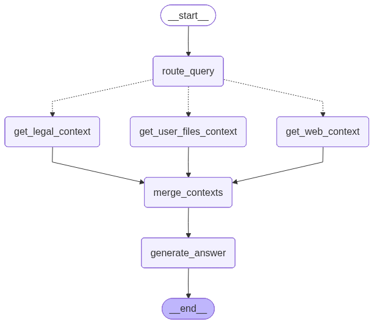

[](https://www.python.org/downloads/)
[](https://docs.chainlit.io/)
[](https://langchain-ai.github.io/langgraph/)
[](https://groq.com/)
[](https://tavily.com/)
[](https://www.trychroma.com/)
[](LICENSE)
[](https://github.com/devbabarsultan/QanoonAI)

# LegalGraph RAG (Chainlit)

This project is a legal question-answering app built with **Chainlit** and a **LangGraph** workflow.

It combines:
- **Legal RAG** from a persistent Chroma collection (`./chroma_db`)
- **User-file RAG** for uploaded documents (PDF/DOCX/TXT) stored in Chroma (`user_files` collection)
- **Web search** (Tavily)
- A **Groq** hosted LLM to generate the final answer

## Architecture



## Quick start

### 1) Install dependencies
```bash
pip install -r requirements.txt
```

### 2) Set environment variables
The app expects:
- `GROQ_API_KEY_2` (Groq)
- `TAVILY_API_KEY` (Tavily)

You can use a `.env` file (the code calls `load_dotenv()`).

### 3) Run the app
```bash
chainlit run app.py
```

## How to use
1. Open the Chainlit UI.
2. Optionally upload legal documents by attaching files (PDF, DOCX, TXT) to your message.
3. Ask a legal question.
4. The system retrieves relevant context from:
   - the base legal collection
   - your uploaded documents (scoped by session/user id)
   - web search results
5. The LLM produces a concise answer.

## Project files
- `app.py` — Chainlit + LangGraph workflow wiring
- `tools/ppc_rag_pipeline.py` — Legal RAG context collector
- `tools/user_files_rag.py` — Upload parsing, chunking, embedding, user-file retrieval
- `tools/web_search.py` — Tavily web search wrapper
- `LegalGraph.png` — diagram shown in this README
- `PPC.pdf`, `ppc_laws.json` — dataset inputs used during graph/data building

## Notes
- The user-file embeddings are stored in the Chroma collection named `user_files` under `./chroma_db`.
- Chroma persists across runs, so uploads will remain available unless you clear the database.

